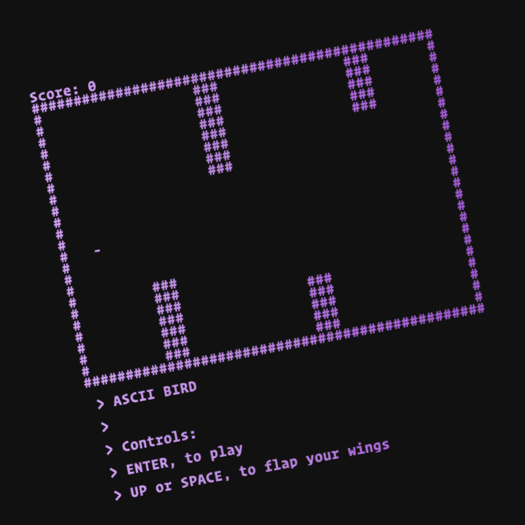

# ASCII BIRD in 5 MINUTES

> Lol this actually took 25 minutes to perform.

_This was a live-coding performance in which I wrote the Flappy Bird game "from scratch", but rendered to ASCII._

It was originally intended to be a workshop for non/beginner programmers! You can find the workshops steps below.

| Talk Content 🗣️ |
| ------- |
| 📺 **[Recorded Video](https://www.youtube.com/watch?v=MxlTdDHlFzo&t=485s)**   🐦 **[Live Demo](https://ascii-bird.glitch.me/)**   👨‍💻 **[Code](./game.js)**   _**Screenshot:**_  |

## Exercise Steps

This can be done as an exercise with a friend! 💁

### Intro

* Yo here is Flappy Bird
* Lets thing of the ingredients of a game like Flappy Bird
* We're going to make it. But with ASCII

### Generating the Obstacles

* Let's think about how we're representing Obstacles (Greed Pipes)
* How can we generate a set of pipes to show statically
* How can we then render them?
* We should not add the progression of time, to push new pipes onto the screen

### The bird! Flap Flap

* Just like Obstacles, how would we represent the player's bird?
    * Rendering the bird
    * Applying gravity

### Adding User Interaction

* How can we use `document.addEventListener` to respond to keyboard?

### Collision of Player and Obstacles

* We don't want the player to "ghost" through obstacles - how can we detect collisions?
* In the same thinking, can we now add the players Score based on avoiding collisions?
* The game then needs a "Bird is too hurt to continue" mode, how should we add it?
* Replaying the game from score 0 should be an option...

### Extras

* An initial "WELCOME" screen
* POWER MODE (press the `o` key in the demo hehehe)

## Credits

This exercise/performance was adapted from a Lightning Talk given at a CampJS! I don't remember the persons name or when the Camp was 😅.

Also shout out to the original Flappy Bird.
